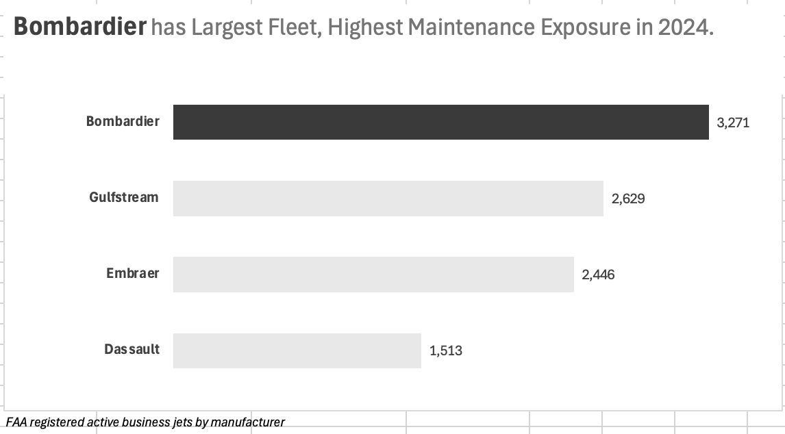
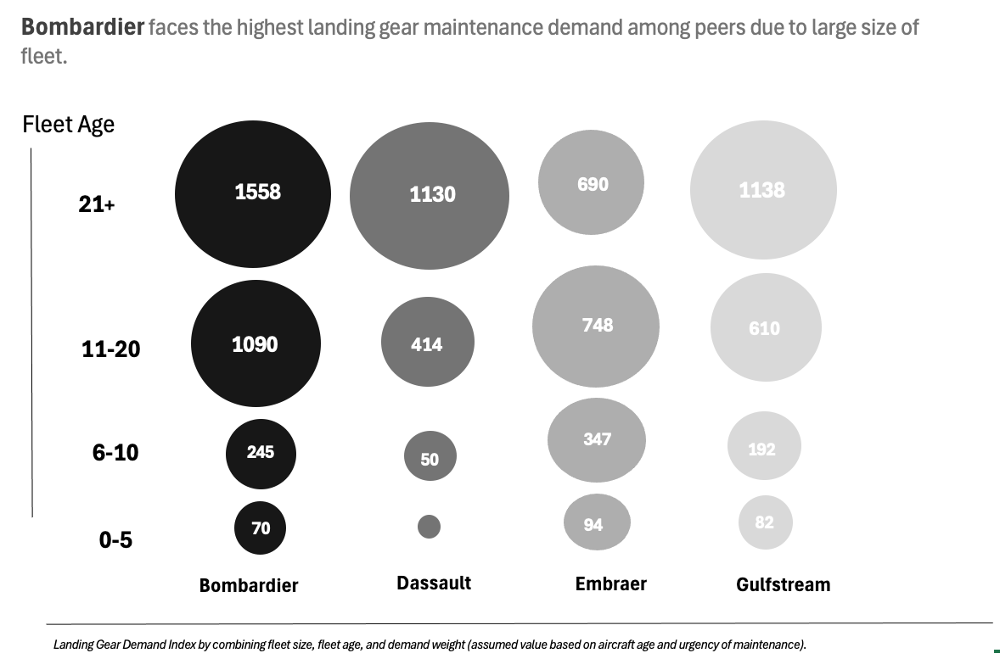
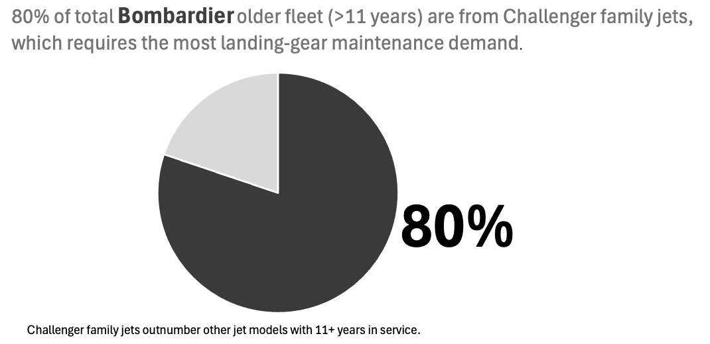

## About Client

Bombardier is a Canadian aerospace manufacturer founded in 1942, with a long-standing presence in the global aviation industry. Today, Bombardier is focused exclusively on the design, manufacturing, and support of business jets, serving corporate, charter, and government customers worldwide. Its product portfolio spans the Challenger and Global aircraft families, which together form one of the largest installed bases in the business-aviation market.
Bombardier operates in a highly competitive environment, with direct peers including Dassault Aviation, Gulfstream Aerospace, and Embraer—all of which compete across similar aircraft segments and aftermarket service offerings.

## Project Title

Can Bombardier’s Operations Absorb Future Landing-Gear Demand?
A 3–5 Year Capacity Planning Analysis for the Challenger Fleet

## Executive Summary

- This project evaluates whether Bombardier can meet future landing-gear maintenance demand driven by an aging business-jet fleet, with emphasis on the Challenger family, which represents the largest share of active aircraft and the primary driver of maintenance volume.

- Fleet aging analysis indicates a meaningful rise in landing-gear maintenance demand, reaching approximately **10% growth by 2027** and accelerating toward **~30% by 2029**, driven by high-utilization, standardized maintenance requirements associated with Challenger aircraft.

- A comparative operational assessment shows that mature service centers are best suited to sustain baseline demand, while throughput-oriented facilities with available expansion headroom are better positioned to absorb incremental growth without disrupting service reliability.

- The analysis concludes that a phased capacity-expansion strategy—anchored by throughput-focused facilities for near-term growth and complemented by authorized partner MROs for medium-term scaling—offers the lowest-risk path to sustaining Bombardier’s aftermarket leadership through 2029. 

## Project Background 

As Bombardier’s installed fleet continues to age, aftermarket services—particularly landing-gear maintenance—have become a critical driver of long-term revenue, customer satisfaction, and operational resilience. Landing gear is a high-value, safety-critical system that requires recurring overhaul as aircraft progress through their service life. Understanding whether Bombardier’s current operational footprint can absorb future maintenance demand is therefore a strategic question with direct implications for capacity planning and service-network optimization.
This project was initiated to evaluate whether Bombardier has sufficient operational capacity to meet projected landing-gear maintenance demand over the next 3–5 years, and to identify where incremental capacity expansion would be most effective.

The analysis focuses on:
- Business jets registered with the FAA +10M rows of data, with emphasis on Bombardier and its direct competitors. 

- Landing-gear maintenance demand, using fleet size and aircraft age as primary demand drivers
- The Challenger aircraft family, which represents the largest share of Bombardier’s active fleet and the dominant contributor to maintenance volume
- North American service facilities, including OEM service centers, line stations, and authorized MRO partners

The primary objectives of this analysis are to:
- Quantify landing-gear maintenance demand based on fleet size and age distribution
- Compare Bombardier’s demand profile against direct competitors
- Assess Bombardier’s operational capacity to absorb near-term (~10% by 2027) and medium-term (~30% by 2029) demand growth
- Identify the most effective facilities to serve as incremental capacity levers
- Provide actionable, risk-aware recommendations to support executive decision-making

### Methodology and Key Steps

To achieve these objectives, the analysis followed a structured approach:

1. Fleet Analysis
 - Extracted and cleaned FAA aircraft registry data
 - Normalized manufacturer and model information
 - Calculated fleet size and age distribution by OEM and aircraft family

2. Demand Modelling
 - Translated fleet age buckets into a landing-gear demand index
 - Identified Challenger-family aircraft as the primary demand driver

3. Operational Assessment
 - Categorized Bombardier’s service network by capability and role
 - Evaluated facilities based on scalability, utilization, and work characteristics

4.  Scenario Planning & Risk Assessment
 - Modelled demand growth scenarios through 2029
 - Identified key operational risks and mitigation strategies

### Data Structure

### High In-Demand Jet Models 

**Challenger Family Landing-Gear Maintenance Demand**

The Challenger family aircraft drives landing-gear maintenance demand due to the following characteristics: 

- Large installed base relative to other Bombardier programs
- Aging fleet profile, with a high proportion of aircraft beyond 11 years of service
- High utilization rates, particularly in corporate and character operations
- Recurring and predictable maintenance cycles, especially for the landing year
- Standarized overhaul work scopes, with limited customization across aircraft

Operation Implications and Facility Fit

Given this demand profile, Challenger landing-gear maintenance is best supported by facilities optimized for high-throughput operations rather than engineering work. Facilities with repeatable, line-based processes, scalable staffing and shift structures, and strong logistics connectivity are well-suited to absorb this type of demand efficiently. Aligning Challenger landing-gear workloads with such throughput-oriented operational environments enables Bombardier to scale capacity in a controlled manner, maintain turnaround times, and manage costs effectively as maintenance demand continues to grow over the next several years. 

### Bombardier Manufacturing Units 

To assess Bombardier's ability to absorb approximately 10% incremental landing-gear maintenance demand for the Challenger family by 2027, we evaluated seven North American service locations with relevant maintenance capability. Each facility was assessed based on its technical capability, current operational role, scalability, and suitability for high-volume, standarized landing-gear work. This analysis focuses not on where landing-gear is currently performed, but on identifying the most efficient and lowest-risk level for incremental capacity expansion within Bombardier's service network. 

Here's the summary analysis on how and why each service center in North America can be or can not be the best choice to cover 10% demand growth by 2027:

**1. Dallas Service Center**

Role: Core baseline heavy maintenance hub

 One of Bombarbier's most mature OEM service centers
- Deep airframe and landing-gear capability
- Strong engineering and workforce experience

**Why Dallas is not the best growth lever to cover 10% growth**

- Likely already optimized for baseline trend
- Mature centers typically operate steady-state utilization
- Rapid expansion risks congestion and service interruption

**Analysis**

Dallas center should continue to anchor baseline Challenger and Global landing-gear demand, but is not the lowest-risk lever for absorbing incremental growth. 

**2. Miami Opa-loca Service Center**

Role: Regional demand hub (Latin America / Southeast US)

- Strategic geographic coverage
- Growing regional fleet demand
- Capable of heavy maintenance tasks

**Why Opa-locka is not the ideal for Challenger growth**

- Regional demand variability
- Less suited for standarized, volume-driven throughput
- Better positioned for geographically driven demand, not global overflow

**Analysis**

Miami Opa-Locka is best utilized for region-specific demand rather than network-wide Challenger throughput expansion. 

**3. Hartforfd Service Center**

Role: Specialized service 

- Supports specific customer requirements
- Contributes to network resilience

**Why Hartford is not suited for covering 10% growth**

- Smaller scale compared to other service centers
- Less suited for high-volume expansion

**Analysis**

Hartford plays a supporting role but lacks the scale required for absorbing material Challenger demand growth. 

**4. Wichita Service Center**

Role: Mature aviation MRO hub

- Strong aviation workforce ecosystem
- Capable airframe maintenance site 

**Why Wichita is not suitable for covering 10% growth**

- Competes for labour with multiple OEMs and MROs
- Expansion may require longer lead times
- Better used for sustaining steady demand

**Analysis**

Wichita supports stable throughput but is less flexible for rapid incremental capacity expansion. 

**5. Tuscon Service Center**

Role: Regional / fleet-specific support

- Geographic diversification 
- Supports specific customer bases (not general)

**Why the Tuscon center can't be ideal to support 10% growth**

- Small scale
- Less Logistic advantage for global Challenger throughput

**Analysis**

The Tuscon Center complements the network but is not optimized for absorbing large volumes of standarized landing-gear work.

**6. Toronto-Pearson (Skyservice)**

- Newer / recent facility
- Designed with modern throughput
- Located in major logistics and labour hubs
- Easier to add shifts, parallel lines, and modular capacity
- Lower distruption risk when absorbing incremental demand

**Analysis**

Toronto-Pearson center is well-suited for rapid expansion to cover the ~10% demand growth. 

**7. Duncan Aviation (BTL) - Authorized Service Facility**

Role: Scalable partner capacity

- Highly capable ASF
- Strong Challenger experience
- Ideal for overflow and long-term scaling

**Why Duncan Aviation Center is good for 10% covering but not ideal compared to Toronto-Pearson?**

- Partner capacity must be coordinated 
- Less direct control than OEM facilities

**Analysis**

If Bombardier has to choose a second option for supporting demand growth, Duncan Aviation Center can be the case. 

| Facility | Capability Level | Network Role | Scalability | Sustainability for 10% (2027) |
|----------|------------------|--------------|-------------|-------------------------------|
| Toronto-Pearson | Heavy / Throughput-oriented | Growth Lever | High | Excellent |
| Dallas | Heavy OEM | Baseline Anchor | Medium | Good |
| Miami Opa-Locka | Heavy OEM | Regional Hub | Medium | Moderate |
| Wichita | Heavy OEM | Stable Throughput | Medium | Moderate |
| Hartford | Medium OEM | Niche Support | Low | Limited |
| Tucson | Medium OEM | Regional Support | Low | Limited |
| Duncan Aviation (BTL) | Heavy ASF | Partner Scalability | High | Strong (post-2027) |

Based on this comparative assessment, Toronto-Pearson emerges as the most effective near-term lever for absorbing approximately 10% Challenger landing-gear demand growth by 2027. Its throughput-oriented design, logistics accessibility, and available expansion headroom allow capacity to be added with lower operational risk compared to more mature service centers. While internal centers such as Dallas continue to anchor baseline demand, Toronto-Pearson is best positioned to absorb incremental volume, with partner MROs, such as Duncan Aviation providing a scalable path to support up to ~30% demand growth by 2029. 

 risks congestion, longer turnaround times, and degradation of service quality. 

**Mitigation Strategy** 
- Maintain mature service centers as baseline demand anchors.
- Redirect incremental growth to facilities designated as growth levers.
- Monitor utilization thresholfs and rebalance workloads dynamically across the network. 

3. Execution Risk During Rapid Scale-Up 

**Risk**
Accelerated capacity expansion may introduce operational inefficiencies, quality risks, or distruption to the existing maintenance operation. 

**Mitigation Strategy**
- Implement phased ramp-up plans (e.g.pilot parallel)
- Use KPIs to govern scale-up.

4. Demand Forecast Uncertainty

**Risk**
Actual landing-gear demand growth may deviate from projections due to changes in utilization, fleet retirement rates, or economic cycles affecting business aviation. 

**Mitigation**
- Design capacity expansion to be modular and reversible (shifts, partners, temporary staffing). 

5. Dependency of External MRO Partners 

**Risk**
Great reliance on Authorized Service Facilities introduces risks for quality consistency and scheduling alignments.

**Mitigation**
- Maintain a balanced mix of external MRO and internal EOM.
- Priotize partners with more history with Challenger maintenance. 

| Key Risk Area | Risk Description | Mitigation Strategy |
|---------------|------------------|---------------------|
|Workforce Availability Risk|The aviation MRO industry is facing a sustained shortage of certified maintenance technicians. Rapid capacity expansion, especially at mature service centers - maybe constrained by hiring lead times, training requirements, and labour competition. | - Priotize expansion at facilities with existing workforce headroom and through-put oriented. 
- Phase capacity increases though additional shifts and process optimization before headcount heavy expansion. |
|Over-Concentration Risk at Mature Service Centers | Routing incremental Challenger landing-gear demand to already mature OEM service centers (e.g. Dallas, Wichita) risks congestion, longer turnaround times, and degradation of service quality. | - Maintain mature service centers as baseline demand anchors.
- Redirect incremental growth to facilities designated as growth levers.
- Monitor utilization thresholfs and rebalance workloads dynamically across the network. | 
| Execution Risk During Rapid Scale-Up | Accelerated capacity expansion may introduce operational inefficiencies, quality risks, or distruption to the existing maintenance operation. | - Implement phased ramp-up plans (e.g.pilot parallel)
- Use KPIs to govern scale-up. |
| Demand Forecast Uncertainty | Actual landing-gear demand growth may deviate from projections due to changes in utilization, fleet retirement rates, or economic cycles affecting business aviation. | - Design capacity expansion to be modular and reversible (shifts, partners, temporary staffing). | 
|Dependency of External MRO Partners | Great reliance on Authorized Service Facilities introduces risks for quality consistency and scheduling alignments. | - Maintain a balanced mix of external MRO and internal EOM.
- Priotize partners with more history with Challenger maintenance. |	

**Executive Takeaway**
By sequencing capacity expansion across internal growth-oriented facilities and certified partners, Bombardier can mitigate workforce, execution, and demand-uncertainty risks while maintaining service reliability through 2029. 

## Recommendations

Bombardier should prioritize a phased expansion of landing-gear maintenance capacity for the Challenger family by leveraging throughput-oriented facilities with available expansion headroom - led by the Toronto-Pearson Service Center - While sustaining baseline demand at mature OEM centers and scaling capacity further through authorized MRO partners to meet medium-term growth. 

**Actionable Plan**

**Near Term (2025 - 2027) | 10% demand increase)**

- *Use Toronto-Pearson as the primary growth lever*
	- Add shifts and parallel work lines
	- Focus on high-volume, standarized Challenger landing-gear work

- *Keep Dallas, Wichita, and Miami focused on:* 
	- Baseline heavy industry
	- Service continuity and reliability

**Medium Term (2027 - 2029 | up to +30 - 32% demand increase)**

- Expand use of Authorized Service Facilities (e.g. Duncan Aviation) for Challenger programs

- Use OEM service centers for complex cases and global-family landing-gear work

- Avoid overloading mature centers that are already optimized for steady demand

## Final Recommendation 

Based on the projected growth in Challenger landing-gear maintenance demand, Bombardier should adopt a phased-capacity expansion strategy. In the near term, incremental demand of approximately 10% by 2027 should be absorbed through throughput-oriented facilities with available headroom, led by Toronto-Pearson Service Center. Mature OEM service centers such as Dallas, Wichita, and Miami should continue to anchor baseline heavy maintenance demand. Beyond 2027, sustaining up to 30-32% demand growth will require broader utilization of authorized MRO partners, allowing Bombardier to scale capacity while preserving operational resilience and service quality. 

